# Haptics Lab

<p align="center">
  
</p>

A Tauri v2 application for exploring, authoring, and replaying haptic patterns on Android devices.

## Quickstart

This repo is configured as a Bun monorepo.

### Prerequisites

- Node.js 20+
- Bun 1.3+
- Rust stable
- Android SDK + NDK + JDK 17
- Tauri system dependencies (webkit2gtk, etc.)

Alternatively, use the provided Devcontainer which has everything pre-installed.

### Commands

| Command                 | Description                                 |
| :---------------------- | :------------------------------------------ |
| `bun install`           | Install dependencies for all packages.      |
| `bun run tauri:dev`     | Run the desktop development server.         |
| `bun run android:init`  | Initialize the Android project (first run). |
| `bun run android:dev`   | Run the app on an Android device/emulator.  |
| `bun run android:build` | Build the Android APK/AAB.                  |
| `bun run icons`         | Regenerate app icons from `assets/icon`.    |
| `bun run validate`      | Run linting, typechecking, and tests.       |

## Plugin

The haptics plugin source code is located in `plugin/tauri-plugin-haptics`.
It includes:

- Rust core logic
- Android Kotlin implementation
- TypeScript guest bindings

## Testing

Run all checks locally:

```bash
bun run validate
```
