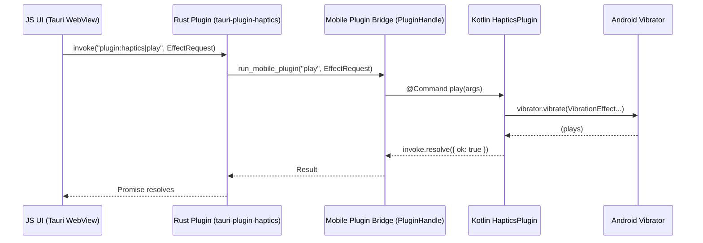

# Tauri v2 Android Haptics Plugin (tauri-plugin-haptics)

# Goal

Build a generic Tauri v2 plugin that lets a JS UI drive Android phone haptics for “haptics lab” experimentation.

The plugin must:

- Work from the Tauri JS layer (invoke-based API).
- Route through a Rust plugin (single cross-platform surface).
- Use native Kotlin on Android (Vibrator / VibrationEffect).
- Expose capability probing + graceful degradation (not all devices support rich features).
- Be safe by default (duration limits, amplitude clamping, respect user settings).

Non-goals:

- Perfectly reproducing DualSense / Joy‑Con haptics (phone actuators and APIs are different).
- Audio-to-haptics DSP in v1 (we’ll leave a hook for later).

# Big picture architecture

Mermaid (data flow)



# API surface (stable JS contract)

Everything centres around one shape: `EffectRequest`.

## Commands

- `capabilities(): Promise<Capabilities>`
- `play(req: EffectRequest): Promise<PlayResult>`
- `stop(): Promise<void>`

Optional (nice-to-have):

- `playPreset(id: PresetId, opts?): Promise<PlayResult>`
- `validate(req: EffectRequest): Promise<ValidationResult>` (client-side validation exists too)

## Types (TS)

```ts
export type HapticsUsage =
	| 'touch' // foreground UI interactions
	| 'notification' // attentional
	| 'alarm' // background-allowed style
	| 'media';

export type EffectRequest = {
	id?: string; // for lab UI: track what you played
	usage?: HapticsUsage; // default from plugin config
	respectSystemSettings?: boolean; // default true
	stopBeforePlay?: boolean; // default true

	// one of:
	effect: OneShot | Waveform | Composition | Predefined | EnvelopeWaveform;
};

export type OneShot = {
	type: 'oneshot';
	durationMs: number;
	amplitude?: number; // 1..255, omit for default
};

export type Waveform = {
	type: 'waveform';
	timingsMs: number[]; // alternates off/on durations; often start with 0
	amplitudes?: number[]; // 0..255; if omitted, becomes on/off waveform
	repeat?: number; // -1 no repeat, else index into timings
};

export type Composition = {
	type: 'composition';
	steps: Array<
		| { kind: 'primitive'; primitive: PrimitiveId; scale?: number; delayMs?: number }
		| { kind: 'effect'; effect: PredefinedEffectId; delayMs?: number }
	>;
};

export type Predefined = {
	type: 'predefined';
	effectId: PredefinedEffectId;
};

// Android 16+ (API 36) only when supported.
export type EnvelopeWaveform = {
	type: 'envelopeWaveform';
	initialFrequencyHz?: number;
	controlPoints: Array<{ amplitude: number; frequencyHz: number; durationMs: number }>;
};

export type Capabilities = {
	hasVibrator: boolean;
	hasAmplitudeControl: boolean;
	effectsSupport?: Record<PredefinedEffectId, 'yes' | 'no' | 'unknown'>;

	// Composition primitives
	compositionSupported: boolean;
	primitives?: Record<PrimitiveId, boolean>;

	// Envelope effects (API 36)
	envelopeSupported: boolean;
	envelopeInfo?: {
		maxSize: number;
		minControlPointDurationMs: number;
		maxControlPointDurationMs: number;
		maxDurationMs: number;
		frequencyProfile?: {
			minHz: number;
			maxHz: number;
		};
	};

	// System toggles
	hapticFeedbackEnabled?: boolean;
};

export type PlayResult = {
	ok: boolean;
	downgraded?: boolean;
	downgradeReason?: string;
};

export type PrimitiveId = 'tick' | 'click' | 'thud' | 'spin' | 'quick_rise' | 'slow_rise';

export type PredefinedEffectId = 'click' | 'double_click' | 'tick' | 'thud' | 'pop' | 'heavy_click';
```

# Plugin configuration (tauri.conf.json)

Under `plugins.haptics`:

```json
{
	"plugins": {
		"haptics": {
			"defaultUsage": "touch",
			"respectSystemHapticsSetting": true,
			"stopBeforePlay": true,
			"maxDurationMs": 10000,
			"maxAmplitude": 255,
			"allowRepeatingWaveforms": false,
			"android": {
				"foregroundAudioUsage": "USAGE_ASSISTANCE_SONIFICATION",
				"backgroundAudioUsage": "USAGE_ALARM"
			}
		}
	}
}
```

Config principles:

- Clamp amplitude/time even if the UI goes wild.
- Repeat loops are opt-in (they’re easy to abuse and annoying).

# Repository layout (plugin)

This assumes a standalone plugin repo (recommended):

```
packages/
  tauri-plugin-haptics/
    Cargo.toml
    README.md
    permissions/
      default.toml
      schemas.toml
    src/
      lib.rs
      commands.rs
      config.rs
      error.rs
      models.rs
      mobile.rs
      desktop.rs
    android/
      build.gradle.kts
      src/main/AndroidManifest.xml
      src/main/java/ca/liminalhq/haptics/HapticsPlugin.kt
    guest-js/
      package.json
      src/index.ts
      src/types.ts
      tsconfig.json
```

# Rust side (tauri plugin)

## `Cargo.toml` (core)

```toml
[package]
name = "tauri-plugin-haptics"
version = "0.1.0"
edition = "2021"

[dependencies]
serde = { version = "1", features = ["derive"] }
serde_json = "1"
ta u r i = { version = "2", features = [] }
thiserror = "2"

[target.'cfg(mobile)'.dependencies]
# comes via tauri; here just showing intent

[features]
default = []
```

(Keep it simple; add feature flags once you add iOS/desktop impls.)

## `src/config.rs`

```rust
use serde::{Deserialize, Serialize};

#[derive(Debug, Clone, Serialize, Deserialize)]
#[serde(rename_all = "camelCase")]
pub struct Config {
  pub default_usage: Option<String>,
  pub respect_system_haptics_setting: Option<bool>,
  pub stop_before_play: Option<bool>,
  pub max_duration_ms: Option<u64>,
  pub max_amplitude: Option<u8>,
  pub allow_repeating_waveforms: Option<bool>,

  #[serde(default)]
  pub android: AndroidConfig,
}

#[derive(Debug, Clone, Default, Serialize, Deserialize)]
#[serde(rename_all = "camelCase")]
pub struct AndroidConfig {
  pub foreground_audio_usage: Option<String>,
  pub background_audio_usage: Option<String>,
}

impl Default for Config {
  fn default() -> Self {
    Self {
      default_usage: Some("touch".into()),
      respect_system_haptics_setting: Some(true),
      stop_before_play: Some(true),
      max_duration_ms: Some(10_000),
      max_amplitude: Some(255),
      allow_repeating_waveforms: Some(false),
      android: AndroidConfig {
        foreground_audio_usage: Some("USAGE_ASSISTANCE_SONIFICATION".into()),
        background_audio_usage: Some("USAGE_ALARM".into()),
      },
    }
  }
}
```

## `src/models.rs`

```rust
use serde::{Deserialize, Serialize};

#[derive(Debug, Clone, Serialize, Deserialize)]
#[serde(rename_all = "camelCase")]
pub struct EffectRequest {
  pub id: Option<String>,
  pub usage: Option<String>,
  pub respect_system_settings: Option<bool>,
  pub stop_before_play: Option<bool>,
  pub effect: Effect,
}

#[derive(Debug, Clone, Serialize, Deserialize)]
#[serde(tag = "type", rename_all = "camelCase")]
pub enum Effect {
  Oneshot { duration_ms: u64, amplitude: Option<u16> },
  Waveform { timings_ms: Vec<u64>, amplitudes: Option<Vec<u16>>, repeat: Option<i32> },
  Predefined { effect_id: String },
  Composition { steps: Vec<CompositionStep> },
  EnvelopeWaveform { initial_frequency_hz: Option<f32>, control_points: Vec<EnvelopePoint> },
}

#[derive(Debug, Clone, Serialize, Deserialize)]
#[serde(rename_all = "camelCase")]
pub struct EnvelopePoint {
  pub amplitude: f32,
  pub frequency_hz: f32,
  pub duration_ms: u64,
}

#[derive(Debug, Clone, Serialize, Deserialize)]
#[serde(tag = "kind", rename_all = "camelCase")]
pub enum CompositionStep {
  Primitive { primitive: String, scale: Option<f32>, delay_ms: Option<u64> },
  Effect { effect: String, delay_ms: Option<u64> },
}

#[derive(Debug, Clone, Serialize, Deserialize)]
#[serde(rename_all = "camelCase")]
pub struct Capabilities {
  pub has_vibrator: bool,
  pub has_amplitude_control: bool,

  pub composition_supported: bool,
  pub primitives: Option<serde_json::Value>,

  pub envelope_supported: bool,
  pub envelope_info: Option<serde_json::Value>,

  pub haptic_feedback_enabled: Option<bool>,
}

#[derive(Debug, Clone, Serialize, Deserialize)]
#[serde(rename_all = "camelCase")]
pub struct PlayResult {
  pub ok: bool,
  pub downgraded: Option<bool>,
  pub downgrade_reason: Option<String>,
}
```

## `src/error.rs`

```rust
use thiserror::Error;

#[derive(Debug, Error)]
pub enum Error {
  #[error("plugin error: {0}")]
  Plugin(#[from] tauri::Error),
  #[error("haptics unsupported on this platform")]
  Unsupported,
  #[error("invalid request: {0}")]
  InvalidRequest(String),
}

pub type Result<T> = std::result::Result<T, Error>;
```

## `src/mobile.rs`

```rust
use tauri::{plugin::PluginHandle, Runtime};

use crate::{models::*, Result};

pub struct Haptics<R: Runtime>(pub PluginHandle<R>);

impl<R: Runtime> Haptics<R> {
  pub fn capabilities(&self) -> Result<Capabilities> {
    self.0
      .run_mobile_plugin("capabilities", ())
      .map_err(Into::into)
  }

  pub fn play(&self, req: EffectRequest) -> Result<PlayResult> {
    self.0
      .run_mobile_plugin("play", req)
      .map_err(Into::into)
  }

  pub fn stop(&self) -> Result<()> {
    self.0
      .run_mobile_plugin("stop", ())
      .map(|_: serde_json::Value| ())
      .map_err(Into::into)
  }
}
```

## `src/desktop.rs`

```rust
use crate::{models::*, Result};

pub struct Haptics;

impl Haptics {
  pub fn capabilities(&self) -> Result<Capabilities> {
    Ok(Capabilities {
      has_vibrator: false,
      has_amplitude_control: false,
      composition_supported: false,
      primitives: None,
      envelope_supported: false,
      envelope_info: None,
      haptic_feedback_enabled: None,
    })
  }

  pub fn play(&self, _req: EffectRequest) -> Result<PlayResult> {
    Err(crate::Error::Unsupported)
  }

  pub fn stop(&self) -> Result<()> {
    Ok(())
  }
}
```

## `src/commands.rs`

```rust
use tauri::{command, Manager, Runtime};

use crate::{models::*, HapticsExt, Result};

#[command]
pub fn capabilities<R: Runtime, T: Manager<R>>(app: T) -> Result<Capabilities> {
  app.haptics().capabilities()
}

#[command]
pub fn play<R: Runtime, T: Manager<R>>(app: T, req: EffectRequest) -> Result<PlayResult> {
  app.haptics().play(req)
}

#[command]
pub fn stop<R: Runtime, T: Manager<R>>(app: T) -> Result<()> {
  app.haptics().stop()
}
```

## `src/lib.rs`

```rust
use tauri::{plugin::{Builder, TauriPlugin}, AppHandle, Manager, Runtime};

mod commands;
mod config;
mod desktop;
mod error;
mod mobile;
mod models;

pub use error::{Error, Result};

#[cfg(mobile)]
use tauri::plugin::PluginHandle;

#[cfg(target_os = "android")]
const PLUGIN_IDENTIFIER: &str = "ca.liminalhq.haptics";

#[cfg(target_os = "ios")]
ta u r i::ios_plugin_binding!(init_plugin_haptics);

pub struct HapticsState<R: Runtime> {
  #[allow(dead_code)]
  app: AppHandle<R>,
  config: config::Config,

  #[cfg(mobile)]
  mobile: mobile::Haptics<R>,

  #[cfg(desktop)]
  desktop: desktop::Haptics,
}

impl<R: Runtime> HapticsState<R> {
  pub fn capabilities(&self) -> Result<models::Capabilities> {
    #[cfg(mobile)]
    { return self.mobile.capabilities(); }

    #[cfg(desktop)]
    { return self.desktop.capabilities(); }
  }

  pub fn play(&self, req: models::EffectRequest) -> Result<models::PlayResult> {
    // TODO: apply Rust-side validation/clamping too (belt & suspenders)
    #[cfg(mobile)]
    { return self.mobile.play(req); }

    #[cfg(desktop)]
    { return self.desktop.play(req); }
  }

  pub fn stop(&self) -> Result<()> {
    #[cfg(mobile)]
    { return self.mobile.stop(); }

    #[cfg(desktop)]
    { return self.desktop.stop(); }
  }
}

pub trait HapticsExt<R: Runtime> {
  fn haptics(&self) -> &HapticsState<R>;
}

impl<R: Runtime, T: Manager<R>> HapticsExt<R> for T {
  fn haptics(&self) -> &HapticsState<R> {
    self.state::<HapticsState<R>>().inner()
  }
}

pub fn init<R: Runtime>() -> TauriPlugin<R, Option<config::Config>> {
  Builder::<R, Option<config::Config>>::new("haptics")
    .js_init_script(include_str!("init-iife.js").to_string())
    .invoke_handler(tauri::generate_handler![
      commands::capabilities,
      commands::play,
      commands::stop,
    ])
    .setup(|app, api| {
      let default_config = config::Config::default();
      let config = api.config().as_ref().unwrap_or(&default_config).clone();

      #[cfg(target_os = "android")]
      let handle: PluginHandle<R> = api.register_android_plugin(PLUGIN_IDENTIFIER, "HapticsPlugin")?;

      #[cfg(target_os = "ios")]
      let handle: PluginHandle<R> = api.register_ios_plugin(init_plugin_haptics)?;

      app.manage(HapticsState {
        app: app.clone(),
        config,
        #[cfg(mobile)]
        mobile: mobile::Haptics(handle),
        #[cfg(desktop)]
        desktop: desktop::Haptics,
      });

      Ok(())
    })
    .build()
}
```

## `src/init-iife.js` (optional global mode)

```js
(function () {
	// Keep minimal; prefer importing from the guest-js package.
	// This exists for users relying on global __TAURI__ mode.
})();
```

# Android (Kotlin) implementation

## `android/src/main/AndroidManifest.xml`

```xml
<manifest xmlns:android="http://schemas.android.com/apk/res/android">
  <uses-permission android:name="android.permission.VIBRATE" />
</manifest>
```

## `android/build.gradle.kts` (library module)

```kotlin
plugins {
  id("com.android.library")
  kotlin("android")
}

android {
  namespace = "ca.liminalhq.haptics"
  compileSdk = 35

  defaultConfig {
    minSdk = 24
  }
}

dependencies {
  // Tauri mobile plugin runtime is provided by the app; keep deps light.
}
```

## `HapticsPlugin.kt`

This file is the heart. It parses `EffectRequest`, validates against device + config, and plays.

```kotlin
package ca.liminalhq.haptics

import android.app.Activity
import android.content.Context
import android.media.AudioAttributes
import android.os.Build
import android.os.VibrationEffect
import android.os.Vibrator
import android.os.VibratorManager
import android.provider.Settings
import android.webkit.WebView
import app.tauri.annotation.Command
import app.tauri.annotation.InvokeArg
import app.tauri.annotation.TauriPlugin
import app.tauri.plugin.Invoke
import app.tauri.plugin.JSArray
import app.tauri.plugin.JSObject
import app.tauri.plugin.Plugin

@InvokeArg
internal class AndroidConfigArgs {
  var foregroundAudioUsage: String? = null
  var backgroundAudioUsage: String? = null
}

@InvokeArg
internal class PluginConfigArgs {
  var defaultUsage: String? = null
  var respectSystemHapticsSetting: Boolean? = null
  var stopBeforePlay: Boolean? = null
  var maxDurationMs: Long? = null
  var maxAmplitude: Int? = null
  var allowRepeatingWaveforms: Boolean? = null
  var android: AndroidConfigArgs? = null
}

@InvokeArg
internal class EffectRequestArgs {
  // NOTE: union types are easiest to parse as a JSObject
  var id: String? = null
  var usage: String? = null
  var respectSystemSettings: Boolean? = null
  var stopBeforePlay: Boolean? = null
  lateinit var effect: JSObject
}

@TauriPlugin
class HapticsPlugin(private val activity: Activity) : Plugin(activity) {

  private var cfg = PluginConfigArgs()
  private val vibrator: Vibrator by lazy { getVibrator(activity) }

  override fun load(webView: WebView) {
    // Pull config from tauri.conf.json if present
    runCatching { getConfig(PluginConfigArgs::class.java) }.onSuccess {
      cfg = it
    }
  }

  @Command
  fun capabilities(invoke: Invoke) {
    val ret = JSObject()

    val hasVibrator = vibrator.hasVibrator()
    ret.put("hasVibrator", hasVibrator)
    ret.put("hasAmplitudeControl", if (hasVibrator) vibrator.hasAmplitudeControl() else false)

    // composition primitives
    val compositionSupported = if (Build.VERSION.SDK_INT >= 30) vibrator.areAllPrimitivesSupported(
      VibrationEffect.Composition.PRIMITIVE_CLICK,
      VibrationEffect.Composition.PRIMITIVE_TICK,
      VibrationEffect.Composition.PRIMITIVE_THUD,
      VibrationEffect.Composition.PRIMITIVE_SPIN,
      VibrationEffect.Composition.PRIMITIVE_QUICK_RISE,
      VibrationEffect.Composition.PRIMITIVE_SLOW_RISE,
    ) else false
    ret.put("compositionSupported", compositionSupported)

    // envelope (API 36)
    val envelopeSupported = if (Build.VERSION.SDK_INT >= 36) vibrator.areEnvelopeEffectsSupported() else false
    ret.put("envelopeSupported", envelopeSupported)

    // system setting (optional)
    val enabled = try {
      Settings.System.getInt(activity.contentResolver, Settings.System.HAPTIC_FEEDBACK_ENABLED, 1) != 0
    } catch (_: Throwable) { null }
    if (enabled != null) ret.put("hapticFeedbackEnabled", enabled)

    if (envelopeSupported && Build.VERSION.SDK_INT >= 36) {
      val info = vibrator.envelopeEffectInfo
      val env = JSObject()
      env.put("maxSize", info.maxSize)
      env.put("minControlPointDurationMs", info.minControlPointDurationMillis)
      env.put("maxControlPointDurationMs", info.maxControlPointDurationMillis)
      env.put("maxDurationMs", info.maxDurationMillis)

      val fp = vibrator.frequencyProfile
      val fpObj = JSObject()
      fpObj.put("minHz", fp.frequencyRangeHz.lower)
      fpObj.put("maxHz", fp.frequencyRangeHz.upper)
      env.put("frequencyProfile", fpObj)

      ret.put("envelopeInfo", env)
    }

    invoke.resolve(ret)
  }

  @Command
  fun stop(invoke: Invoke) {
    vibrator.cancel()
    invoke.resolve(JSObject())
  }

  @Command
  fun play(invoke: Invoke) {
    val args = invoke.parseArgs(EffectRequestArgs::class.java)

    // honour system setting if configured
    val respect = args.respectSystemSettings ?: (cfg.respectSystemHapticsSetting ?: true)
    if (respect) {
      val enabled = try {
        Settings.System.getInt(activity.contentResolver, Settings.System.HAPTIC_FEEDBACK_ENABLED, 1) != 0
      } catch (_: Throwable) { true }
      if (!enabled) {
        val ret = JSObject()
        ret.put("ok", true)
        ret.put("downgraded", true)
        ret.put("downgradeReason", "System touch haptics disabled")
        invoke.resolve(ret)
        return
      }
    }

    val stopBefore = args.stopBeforePlay ?: (cfg.stopBeforePlay ?: true)
    if (stopBefore) vibrator.cancel()

    val effectObj = args.effect
    val type = effectObj.getString("type")

    val maxAmp = (cfg.maxAmplitude ?: 255).coerceIn(1, 255)
    val maxDur = (cfg.maxDurationMs ?: 10_000).coerceAtLeast(1)

    val (effect, downgraded, downgradeReason) = try {
      buildEffect(effectObj, vibrator, maxAmp, maxDur, cfg)
    } catch (e: Throwable) {
      invoke.reject("INVALID_EFFECT", e.message ?: "Invalid haptics request")
      return
    }

    val usage = (args.usage ?: cfg.defaultUsage ?: "touch")
    val aa = audioAttributesForUsage(usage, cfg)

    // API surface differs by SDK; AudioAttributes works broadly.
    if (Build.VERSION.SDK_INT >= 21) {
      vibrator.vibrate(effect, aa)
    } else {
      // Very old fallback (unlikely in practice with Tauri minSdk)
      vibrator.vibrate(200)
    }

    val ret = JSObject()
    ret.put("ok", true)
    if (downgraded) {
      ret.put("downgraded", true)
      ret.put("downgradeReason", downgradeReason)
    }
    invoke.resolve(ret)
  }

  private fun buildEffect(
    effectObj: JSObject,
    vibrator: Vibrator,
    maxAmp: Int,
    maxDur: Long,
    cfg: PluginConfigArgs,
  ): Triple<VibrationEffect, Boolean, String?> {

    val type = effectObj.getString("type")

    return when (type) {
      "oneshot" -> {
        val dur = effectObj.getLong("durationMs").coerceAtMost(maxDur)
        val ampRaw = if (effectObj.has("amplitude")) effectObj.getInt("amplitude") else -1
        val amp = if (ampRaw <= 0) VibrationEffect.DEFAULT_AMPLITUDE else ampRaw.coerceIn(1, maxAmp)
        Triple(VibrationEffect.createOneShot(dur, amp), false, null)
      }

      "waveform" -> {
        val timings = toLongArray(effectObj.getArray("timingsMs"))
        val repeat = if (effectObj.has("repeat")) effectObj.getInt("repeat") else -1

        // Enforce repeat safety
        val allowRepeat = cfg.allowRepeatingWaveforms ?: false
        val safeRepeat = if (!allowRepeat && repeat >= 0) -1 else repeat

        if (effectObj.has("amplitudes")) {
          val amps = toIntArray(effectObj.getArray("amplitudes")).map { it.coerceIn(0, maxAmp) }.toIntArray()
          val capped = capWaveformDuration(timings, maxDur)
          val eff = if (vibrator.hasAmplitudeControl()) {
            VibrationEffect.createWaveform(capped, amps, safeRepeat)
          } else {
            // Downgrade: non-zero amplitudes become full on; use timings-only
            VibrationEffect.createWaveform(capped, safeRepeat)
          }
          val downgraded = !vibrator.hasAmplitudeControl()
          Triple(eff, downgraded, if (downgraded) "Device lacks amplitude control" else null)
        } else {
          val capped = capWaveformDuration(timings, maxDur)
          Triple(VibrationEffect.createWaveform(capped, safeRepeat), false, null)
        }
      }

      "predefined" -> {
        val id = effectObj.getString("effectId")
        val effId = mapPredefinedEffect(id)
        Triple(VibrationEffect.createPredefined(effId), false, null)
      }

      "composition" -> {
        if (Build.VERSION.SDK_INT < 30) {
          // Downgrade to a click
          Triple(VibrationEffect.createPredefined(VibrationEffect.EFFECT_CLICK), true, "Composition requires API 30+")
        } else {
          val steps = effectObj.getArray("steps")
          val comp = VibrationEffect.startComposition()

          for (i in 0 until steps.length()) {
            val step = steps.getObject(i)
            val kind = step.getString("kind")
            val delay = if (step.has("delayMs")) step.getLong("delayMs") else 0L

            when (kind) {
              "primitive" -> {
                val primId = mapPrimitive(step.getString("primitive"))
                val scale = if (step.has("scale")) step.getDouble("scale").toFloat().coerceIn(0f, 1f) else 1f
                comp.addPrimitive(primId, scale, delay)
              }
              "effect" -> {
                val eff = mapPredefinedEffect(step.getString("effect"))
                comp.addEffect(VibrationEffect.createPredefined(eff), delay)
              }
            }
          }

          // If any primitive unsupported, composition may not play; you can pre-check in UI via capabilities.
          Triple(comp.compose(), false, null)
        }
      }

      "envelopeWaveform" -> {
        if (Build.VERSION.SDK_INT < 36 || !vibrator.areEnvelopeEffectsSupported()) {
          Triple(VibrationEffect.createPredefined(VibrationEffect.EFFECT_TICK), true, "Envelope requires API 36+ and device support")
        } else {
          val builder = VibrationEffect.WaveformEnvelopeBuilder()
          if (effectObj.has("initialFrequencyHz")) {
            builder.setInitialFrequencyHz(effectObj.getDouble("initialFrequencyHz").toFloat())
          }
          val cps = effectObj.getArray("controlPoints")
          for (i in 0 until cps.length()) {
            val cp = cps.getObject(i)
            val amp = cp.getDouble("amplitude").toFloat().coerceIn(0f, 1f)
            val hz = cp.getDouble("frequencyHz").toFloat().coerceAtLeast(1f)
            val dur = cp.getLong("durationMs").coerceAtLeast(1).coerceAtMost(maxDur)
            builder.addControlPoint(amp, hz, dur)
          }
          Triple(builder.build(), false, null)
        }
      }

      else -> throw IllegalArgumentException("Unknown effect type: $type")
    }
  }

  private fun capWaveformDuration(timings: LongArray, maxDur: Long): LongArray {
    var total = 0L
    val out = LongArray(timings.size)
    for (i in timings.indices) {
      val remain = (maxDur - total).coerceAtLeast(0)
      val v = timings[i].coerceAtLeast(0)
      val capped = v.coerceAtMost(remain)
      out[i] = capped
      total += capped
      if (total >= maxDur) {
        // zero out the rest
        for (j in i + 1 until timings.size) out[j] = 0
        break
      }
    }
    return out
  }

  private fun toLongArray(arr: JSArray): LongArray {
    val out = LongArray(arr.length())
    for (i in 0 until arr.length()) out[i] = arr.getLong(i)
    return out
  }

  private fun toIntArray(arr: JSArray): IntArray {
    val out = IntArray(arr.length())
    for (i in 0 until arr.length()) out[i] = arr.getInt(i)
    return out
  }

  private fun audioAttributesForUsage(usage: String, cfg: PluginConfigArgs): AudioAttributes {
    val u = usage.lowercase()

    val mappedUsage = when (u) {
      "alarm" -> AudioAttributes.USAGE_ALARM
      "notification" -> AudioAttributes.USAGE_NOTIFICATION
      "media" -> AudioAttributes.USAGE_MEDIA
      else -> AudioAttributes.USAGE_ASSISTANCE_SONIFICATION
    }

    return AudioAttributes.Builder()
      .setContentType(AudioAttributes.CONTENT_TYPE_SONIFICATION)
      .setUsage(mappedUsage)
      .build()
  }

  private fun mapPredefinedEffect(id: String): Int {
    return when (id.lowercase()) {
      "click" -> VibrationEffect.EFFECT_CLICK
      "double_click" -> VibrationEffect.EFFECT_DOUBLE_CLICK
      "tick" -> VibrationEffect.EFFECT_TICK
      "thud" -> VibrationEffect.EFFECT_THUD
      "pop" -> VibrationEffect.EFFECT_POP
      "heavy_click" -> VibrationEffect.EFFECT_HEAVY_CLICK
      else -> VibrationEffect.EFFECT_CLICK
    }
  }

  private fun mapPrimitive(id: String): Int {
    return when (id.lowercase()) {
      "tick" -> VibrationEffect.Composition.PRIMITIVE_TICK
      "click" -> VibrationEffect.Composition.PRIMITIVE_CLICK
      "thud" -> VibrationEffect.Composition.PRIMITIVE_THUD
      "spin" -> VibrationEffect.Composition.PRIMITIVE_SPIN
      "quick_rise" -> VibrationEffect.Composition.PRIMITIVE_QUICK_RISE
      "slow_rise" -> VibrationEffect.Composition.PRIMITIVE_SLOW_RISE
      else -> VibrationEffect.Composition.PRIMITIVE_CLICK
    }
  }

  private fun getVibrator(ctx: Context): Vibrator {
    return if (Build.VERSION.SDK_INT >= Build.VERSION_CODES.S) {
      val vm = ctx.getSystemService(VibratorManager::class.java)
      vm.defaultVibrator
    } else {
      @Suppress("DEPRECATION")
      ctx.getSystemService(Context.VIBRATOR_SERVICE) as Vibrator
    }
  }
}
```

Notes:

- All commands execute on the main thread by default. This implementation stays fast.
- Waveform repeat is blocked unless explicitly enabled.
- Amplitude waveforms degrade to timings-only if amplitude control is missing.
- Envelope effects are strictly optional (API 36 + device support).

# JS package (guest-js)

## `guest-js/src/index.ts`

```ts
import { invoke } from '@tauri-apps/api/core';
import type { Capabilities, EffectRequest, PlayResult } from './types';

export function capabilities(): Promise<Capabilities> {
	return invoke('plugin:haptics|capabilities');
}

export function play(req: EffectRequest): Promise<PlayResult> {
	return invoke('plugin:haptics|play', { req });
}

export function stop(): Promise<void> {
	return invoke('plugin:haptics|stop');
}
```

## `guest-js/src/types.ts`

(Use the TS types from the earlier “API surface” section.)

# Permissions (Tauri)

If you want a permissions model like the official plugins:

`permissions/default.toml`

```toml
[default]
description = "Default permissions for haptics"
permissions = [
  "allow-capabilities",
  "allow-play",
  "allow-stop",
]
```

`permissions/schemas.toml`

```toml
[[permission]]
identifier = "allow-capabilities"
description = "Allow querying haptics capabilities"
commands = ["capabilities"]

[[permission]]
identifier = "allow-play"
description = "Allow playing haptics"
commands = ["play"]

[[permission]]
identifier = "allow-stop"
description = "Allow stopping haptics"
commands = ["stop"]
```

# Integrating into the Haptics Lab Tauri app

## `src-tauri/Cargo.toml`

```toml
[dependencies]
ta u r i = { version = "2" }
ta u r i-plugin-haptics = { path = "../plugin/tauri-plugin-haptics" }
```

## `src-tauri/src/lib.rs`

```rust
pub fn run() {
  tauri::Builder::default()
    .plugin(tauri_plugin_haptics::init())
    .run(tauri::generate_context!())
    .expect("error while running tauri application");
}
```

## UI usage

```ts
import * as haptics from '@liminal-hq/plugin-haptics';

const caps = await haptics.capabilities();

await haptics.play({
	usage: 'touch',
	effect: {
		type: 'waveform',
		timingsMs: [0, 15, 10, 30, 10, 60],
		amplitudes: [0, 80, 0, 140, 0, 220],
	},
});
```

# “DualSense-ish” mapping guidance (what’s realistic on phones)

You can aim for similar _shapes_ even if you can’t match the same actuator physics.

- Joy‑Con / DualSense can express a wide range because they’re designed for haptics (HD rumble / voice‑coil).
- Phones typically have an LRA with strong tuning and a narrower expressive range.

In practice:

- Use short, high-contrast waveforms to create “texture” (ticks, rattles, bumps).
- Use composition primitives when available to get more polished, device‑tuned sensations.
- Treat envelope waveform (API 36) as your future “closest to controller” mechanism because it can specify frequency + amplitude over time.

# Next steps

1. Build the minimal plugin: `capabilities / play / stop` with oneshot + waveform.
2. Add composition primitives + UI that shows primitive support.
3. Add envelope waveform UI guarded by: `caps.envelopeSupported`.
4. Add a small library of presets in the lab app (JSON patterns) + a “share pattern” export.
5. If you still want “audio driven haptics”, add a DSP layer in Rust that converts an amplitude envelope (or band-limited signal) into either:
   - waveforms (timings + amplitude), or
   - envelope control points (when supported).
